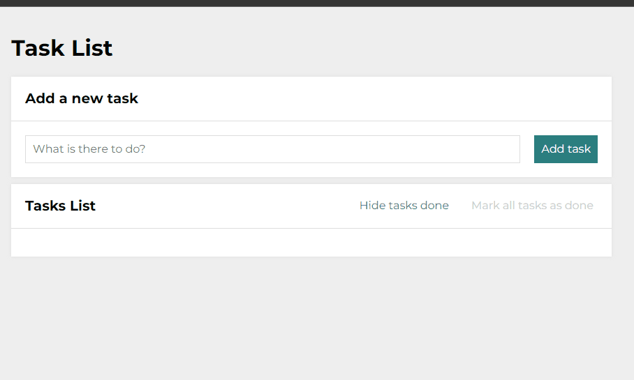

# ToDo-List

## It is a simple application that was created for daily use to help organize and prioritize tasks to be done.

You can also test it yourself, it is very easy to use:
- in the window "What is there to do?" (marked with a box) we type the task we want to add to our list,
- then press the "Add task" button (green button),
- the task will jump to the list below marked "Task List"
- to deselect the task, press the small green square (button) next to the name of your task,
- if you decide that you no longer need the task on the list, you can also delete it using the red square with the trash can icon (button).

### You can also test the application yourself.

Link below:

## Demo

https://tomaszbrylski.github.io/ToDo-List-react/

### Languages / Technologies
- React
- HTML
- Java Script
- CSS Grid
- CSS Flex
- BEM
- Normalize.css
- Styled Components
- Media Queries
- Redux
- Redux Toolkit
- ScreenToGit
- MidJourney 

# Getting Started with Create React App

This project was bootstrapped with [Create React App](https://github.com/facebook/create-react-app).

## Available Scripts

In the project directory, you can run:

### `npm start`

Runs the app in the development mode.\
Open [http://localhost:3000](http://localhost:3000) to view it in your browser.

The page will reload when you make changes.\
You may also see any lint errors in the console.

### `npm run build`

Builds the app for production to the `build` folder.\
It correctly bundles React in production mode and optimizes the build for the best performance.

The build is minified and the filenames include the hashes.\
Your app is ready to be deployed!

See the section about [deployment](https://facebook.github.io/create-react-app/docs/deployment) for more information.

### `npm run eject`

**Note: this is a one-way operation. Once you `eject`, you can't go back!**

If you aren't satisfied with the build tool and configuration choices, you can `eject` at any time. This command will remove the single build dependency from your project.

Instead, it will copy all the configuration files and the transitive dependencies (webpack, Babel, ESLint, etc) right into your project so you have full control over them. All of the commands except `eject` will still work, but they will point to the copied scripts so you can tweak them. At this point you're on your own.
